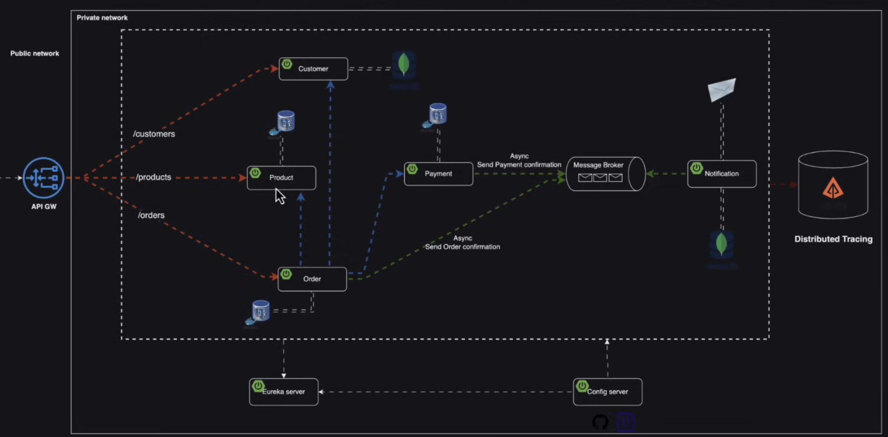

# 🛒 E-Commerce Order Management System

## 📖 Overview

As an e-commerce business owner, I currently manage my operations without any digital solution. This project aims to build a dedicated application that automates and streamlines the entire order management process, improving efficiency, scalability, and customer experience.

---

## 🎯 Business Context

The business offers a catalog of products, where each product includes:

- 🆔 A unique product code
- 📝 A detailed description

Customers can browse this catalog and place orders for the products they wish to purchase.

---

## 👤 Customer Management

Each customer is identified by the following information:

- First name
- Last name
- Email address
- Shipping address

---

## 💳 Payment Processing

Every order is associated with a payment method.

After a payment is processed, the system automatically notifies the customer by email:

- ✅ Payment successful confirmation
- ❌ Payment failure notification

---

## 🚀 Project Goal

The objective of this application is to digitize and automate the business workflow by providing:

- 📦 Product management
- 👥 Customer management
- 🛍️ Order management
- 💳 Secure payment processing
- 📧 Automatic email notifications

This solution is designed to simplify day-to-day operations while providing a scalable foundation for future business growth.

---

## 🌟 Expected Benefits

- Improved operational efficiency
- Reduced manual work
- Better customer experience
- Automated communication
- Scalable architecture for future expansion

# 🛠️ Tech Stack

## Backend

- ☕ Java 21
- 🌱 Spring Boot 4
- Spring Web
- Spring Data JPA
- Spring Cloud

## Microservices

- 👤 Customer Service
- 📦 Product Service
- 🛒 Order Service
- 💳 Payment Service
- 📧 Notification Service

## Service Discovery & Configuration

- 🔍 Eureka Server (Service Discovery)
- ⚙️ Spring Cloud Config Server

## API Gateway

- 🚪 Spring Cloud Gateway

## Database

- 🐘 PostgreSQL (one database per microservice)
- 🍃 MongoDB (Notification Service)

## Messaging

- 📨 Apache Kafka (Message Broker)
- Asynchronous event-driven communication

## Email

- ✉️ Spring Mail

## Distributed Tracing & Monitoring

- 📊 Zipkin

## Build & Dependency Management

- Maven

## Containerization

- 🐳 Docker
- Docker Compose

## Version Control

- Git
- GitHub